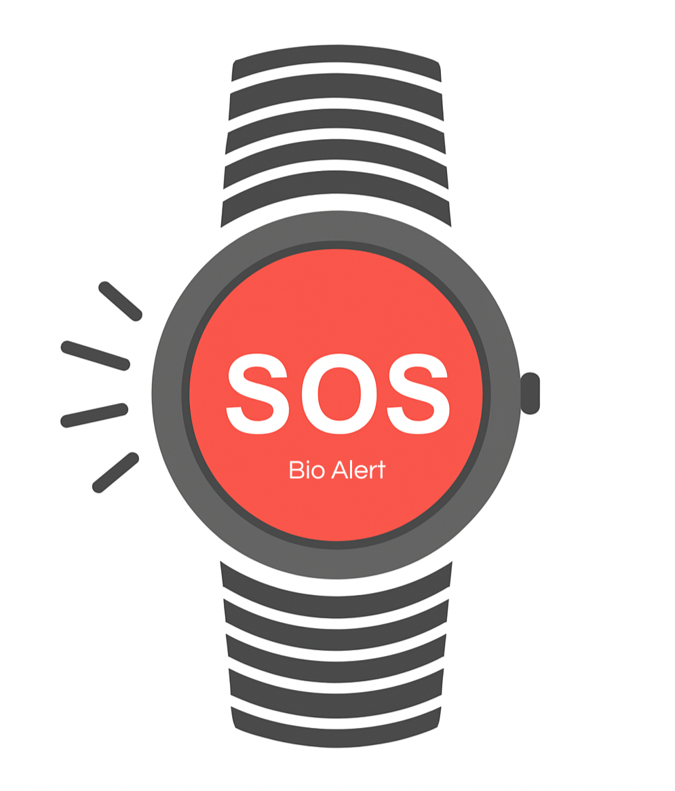

# Zen-Tech - Documentação

 

<a  href="#sobre">Sobre o Projeto</a> |
<a  href="#backlogs">Product Backlog</a> |
<a  href="#sprint">Entrega de Sprints</a> |
<a  href="#tecnologias">Tecnologias</a> |
<a  href="#equipe">Nossa Equipe</a> |

  
 

<h2>
Sobre o Projeto :📋 
</h2>

Sistema de Detecção de Quedas para Idosos.

Muitas pessoas em idade avançada permanecem sozinhas em casa, o que aumenta o risco em casos
de queda. 

O Bio Alert é uma solução tecnológica desenvolvida pela Zentech para aumentar a segurança de idosos que permanecem sozinhos em casa. O sistema utiliza sensores 
inteligentes, pela pulseira, para detectar automaticamente quedas e acionar rapidamente mecanismos de alerta, garantindo socorro imediato em situações de emergência.

**Objetivo Principal:**

O objetivo é especificar e implementar um sistema que detecte automaticamente quedas e envie
os dados via Wi-Fi para um aplicativo mobile de monitoramento. O sistema também deverá emitir
alertas por SMS para um número previamente cadastrado sempre que for detectada uma
ocorrência classificada como queda.

**Principais Funcionalidades:**
- 🛡️  Sistema de Cadastro e Vinculação  
- ⚠️  Detecção Automática de Quedas
- 💬  Alertas Imediatos por SMS
- 🚨  Alerta queda(pulseira)  
- 📱  Interface simples e responsiva
<h2>

 Protótipo do Projeto : 📱
</h2>
Figma (wireframe):<a href="https://share.google/fCjJlhN0PqWNUljTA">Clique Aqui!</a>
 

<h2>
 Jornada do usuário :
</h2>
 
 [Jornada do usuário ](./EU/EU-02-PersonaEJornadaDoUsuário-Modelo.pdf)

 

##### [🔝 Voltar ao topo ](#topo)

<h2 id="sprint">
Entregas de Sprints e Tasks :
</h2>

Todas as entregas serão realizadas conforme os prazos acordados com o cliente. Para cada ciclo de desenvolvimento, será gerado um relatório completo por sprint e uma planilha de tarefas, na aba Tasks, que detalha cada atividade executada, o responsável, a data de conclusão e uma descrição do trabalho realizado. A relação detalhada das sprints e tarefas é apresentada abaixo.

| Sprint | Previsão de Entrega | Status | Relatório | Tasks |
| ------ | -------------------- | ------ | --------- |-------|
|   1    | 📅 07/10/2025        | :white_check_mark:| [:round_pushpin: Ver Relatório](./Sprint01.md) |[:round_pushpin: Ver Relatório](./taskSprint1.md) |
|   2    | 📅 04/11/2025        |:white_check_mark: | [:round_pushpin: Ver Relatório](./Sprint02.md) | [:round_pushpin: Ver Relatório](./taskSprint2.md)|
|   3    | 📅 25/11/2025        | :construction:| [:round_pushpin: Ver Relatório](./Sprint03.md) | [:round_pushpin: Ver Relatório]()|

Legenda:
- :white_check_mark: **Finalizada**
- :construction: **Em Progresso**
- [-] **Não iniciado**

A apresentação da Sprint 1 em vídeo por ser acessada por [aqui!](https://www.youtube.com/watch?v=f40Za_Fj7MA)  
A apresentação da Sprint 2 em vídeo por ser acessada por [aqui!](https://www.youtube.com/watch?v=wLTZEGiM2kk)

##### [🔝 Voltar ao topo ](#topo)

<h2>
Product Backlog :
</h2>
  

   
|item        | Funcionalidade                     | Descrição                                                                                   | Prioridade |
|--------------|------------------------------------|---------------------------------------------------------------------------------------------|------------|
|S1 RNF - EU  |	**Protótipo Figma - Wireframe**	|	Protótipo das telas do app no Figma	|	ALTA	|	
|S1 RNF - PD |	**Protótipo de telas - ExpoGo**		|	Protótipo de telas no ExpoGo utilizando React Native |	ALTA	|
|S1 RNF - IC |	**Organização - Github**	|	Início de documentação e início da implantação das regras CI/CD			|	ALTA	|
|S1 RNF - IT |	**Pesquisa sobre Acelerômetros**	|	Pesquisa e comparação entre os Acelerômetros	para adquirir o mais adequado para o projeto	|	ALTA	|
|S1 RNF - LW |	**BD - Criação Banco de Dados**	|	Criação Banco de dados Relacional		|	ALTA	|
|S2 RNF - EU  |	**Frontend - Telas de Cadastro e Inicial**	|	Criação do Frontend telas de cadastro e inicial |	ALTA	|	
|S2 RNF - PD |	**Requisições de teste com o backend**		|	Realizar requisições de teste com o backend |	ALTA	|
|S2 RNF - IC |	**Aplicação de Regras CI/CD**	|	Continuação de documentação e início da implantação das regras CI/CD			|	ALTA	|
|S2 RNF - IT |	**BD - Conexão Arduino e Backend**	|	Conexão entre o sistema Arduino e integração do backend ao banco de dados relacional	|	ALTA	|	
|S2 RNF - LW |	**Backend - Tela de Cadastro**	|	Criação do Backend da página de Cadastro	|	ALTA	|	

  

 

##### [🔝 Voltar ao topo ](#topo)

<h2>
Requisitos do Cliente :
</h2>

 <h3> Requisitos funcionais :</h3>
  

    RF01 –  O sistema deve detectar automaticamente eventos classificados como queda, com base em dados de movimento;
  
 
  

    RF02 – O sistema deve enviar os dados de detecção via Wi-Fi para um aplicativo mobile de monitoramento;
  

  

      RF03 – O sistema deve permitir o cadastro de um número de telefone para recebimento de alertas por SMS;
  

  

    RF04 – O sistema deve enviar alertas por SMS automaticamente quando uma queda for detectada;
  

  

     RF05 – O aplicativo mobile deve exibir o status de monitoramento em tempo real. 
  

   
  
<h3>Requisitos não funcionais :</h3>

RNF01 – O sistema deve garantir baixa latência na transmissão de dados entre o dispositivo IoT e o backend;

RNF02 – O aplicativo mobile deve possuir interface intuitiva e acessível, adequada ao perfil do usuário idoso ou familiar;

RNF03 – A solução deve utilizar tecnologias de containerização (Docker) e pipeline de CI/CD;

 

##### [🔝 Voltar ao topo ](#topo)

<h2>
Tecnologias :

</h2>

 
<!-- TypeScript -->

<!-- MongoDB -->

<!-- React -->

<!-- Figma -->

<!-- Node.js -->

<!-- Trello -->

<!-- VS Code -->

<!-- Docker -->

 

##### [🔝 Voltar ao topo ](#topo)

<h2>
  
Nossa Equipe :
</h2>

| Função          | Nome                          | Links                                                                                                                         |
|-----------------|-------------------------------|-------------------------------------------------------------------------------------------------------------------------------|
| Project Owner   | Edlaine De Paula Souza | <a href="https://github.com/edlaine-souza">Github</a>|
| Scrum Master    | Bruno Henrique Menezes Ramos | <a href="">Github</a> |
| Dev Team        | Tiago Santini Da Silva     | <a href="https://github.com/TiagoSan77">Github</a>|
| Dev Team        | Luana Pinheiro dos Santos Ve | <a href="">Github</a>|
| Dev Team        | Vinicius Barbosa Fernandes    | <a href="">Github</a>|
| Dev Team        | Rodrigo De Andrade Paula |<a href="">Github</a> |

