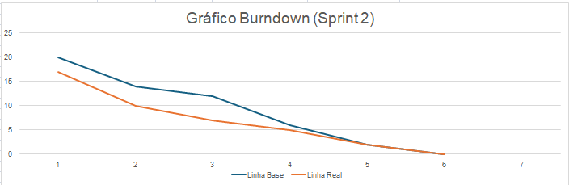

# Zen-Tech - Sprint 2

 

<h2 id="sprint">
Entregas de Sprints e Tasks : 
</h2>

Todas as entregas foram realizadas conforme os prazos acordados com o cliente. Para cada ciclo de desenvolvimento, foi gerado um relatório completo por sprint e uma planilha de tarefas, na aba Tasks, que detalha cada atividade executada, o responsável, a data de conclusão e uma descrição do trabalho realizado. A relação detalhada das sprints e tarefas é apresentada abaixo:

| Sprint | Previsão de Entrega | Status | Relatório | Tasks |
| ------ | -------------------- | ------ | --------- |-------|
|   1    | 📅 07/10/2025        | :white_check_mark:| [:round_pushpin: Ver Relatório](./Sprint01.md) |[:round_pushpin: Ver Relatório](./taskSprint1.md) |
|   2    | 📅 04/11/2025        | :white_check_mark:| [:round_pushpin: Ver Relatório]() | [:round_pushpin: Ver Relatório](./taskSpint2.md)|
|   3    | 📅 25/11/2025        | [-]| [:round_pushpin: Ver Relatório]() | [:round_pushpin: Ver Relatório]()|

Legenda:
- :white_check_mark: **Finalizada**
- :construction: **Em Progresso**
- [-] **Não iniciado**

##### [🔝 Voltar ao topo ](#topo)

<h2>
Backlog da Spint 1:
</h2>
  

   
|item  | Funcionalidade                     | Descrição                                                                                   | Prioridade |
|----------|------------------------------------|---------------------------------------------------------------------------------------------|------------|
| RF01 | **Protótipo das páginas**           | Desenvolver páginas de Home, Início, Cadastro e Menu | ALTA
| RF02| **Página Configuração de Emergência**              | Criar página para configuração de contatos de emergência.                     | ALTA       |
| RF03 | **Wireframe do Aplicativo**                  | Criar estrutura básica do wireframe.                     | ALTA       |
|RNF01	|**Criação do repositório Github**			|Criar repositório principal e repositório para gestão de tasks		|ALTA	|
|RNF02	|**Documentação do Readme**				|Atualizar página do Readme do Github com documentação do projeto	|ALTA	|
|RNF03	|**Levantamento de requisitos**			|Elaborar requisitos e tasks para as 3 Sprints				|ALTA	|
|RNF04	|**Backlog Priorizado**				|Criar backlog priorizado por Sprints					|ALTA	|
|RNF05	|**Jornada do Usuário**				|Documentar requisito solicitado pelo professor (Jornada do Usuário)	|ALTA	|
|RNF06	|**Desenvolvimento da Logo**			|Criar identidade visual do aplicativo					|MEDIA	|
|RNF07	|**Modelagem do Banco de Dados**			|Criar UML do banco de dados						|ALTA	|
|RNF08	|**Implementação do Banco**				|Configurar o Banco em ambiente de nuvem				|ALTA	|
|RNF09	|**Análise de Sensores**				|Levantar pontos positivos/negativos MPU6050 e MPU9250			|ALTA	|
|RNF10	|**Montagem do Circuito**				|Montar circuito ESP32 + acelerômetro					|ALTA	|
|RNF11	|**Simulação Hardware**				|Simulação do funcionamento do sistema com a ESP32					|ALTA	|	
|RNF12	|**Priorização MoSCoW**				|Mapa de expectativas (MoSCoW)					|MÉDIA	|
	
  

##### [🔝 Voltar ao topo ](#topo)
 

  <h2>Burndown Sprint 01</h2>
  

 
 

| Função          | Nome                          | Links                                                                                                                         |
|-----------------|-------------------------------|-------------------------------------------------------------------------------------------------------------------------------|
| Project Owner   | Edlaine De Paula Souza | <a href="https://github.com/edlaine-souza">Github</a>|
| Scrum Master    | Bruno Henrique Menezes Ramos | <a href="">Github</a> |
| Dev Team        | Tiago Santini Da Silva     | <a href="https://github.com/TiagoSan77">Github</a>|
| Dev Team        | Luana Pinheiro dos Santos Ve | <a href="">Github</a>|
| Dev Team        | Vinicius Barbosa Fernandes    | <a href="">Github</a>|
| Dev Team        | Rodrigo De Andrade Paula |<a href="">Github</a> |

