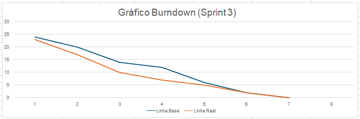

# Zen-Tech - Sprint 3

 

<h2 id="sprint">
Entregas de Sprints e Tasks : 
</h2>

Todas as entregas foram realizadas conforme os prazos acordados com o cliente. Para cada ciclo de desenvolvimento, foi gerado um relatório completo por sprint e uma planilha de tarefas, na aba Tasks, que detalha cada atividade executada, o responsável, a data de conclusão e uma descrição do trabalho realizado. A relação detalhada das sprints e tarefas é apresentada abaixo:

| Sprint | Previsão de Entrega | Status | Relatório | Tasks |
| ------ | -------------------- | ------ | --------- |-------|
|   1    | 📅 07/10/2025        | :white_check_mark:| [:round_pushpin: Ver Relatório](./Sprint01.md) |[:round_pushpin: Ver Relatório](./taskSprint1.md) |
|   2    | 📅 04/11/2025        | :white_check_mark:| [:round_pushpin: Ver Relatório]() | [:round_pushpin: Ver Relatório](./taskSpint2.md)|
|   3    | 📅 25/11/2025        | :white_check_mark:| [:round_pushpin: Ver Relatório]() | [:round_pushpin: Ver Relatório]()|

Legenda:
- :white_check_mark: **Finalizada**
- :construction: **Em Progresso**
- [-] **Não iniciado**

##### [🔝 Voltar ao topo ](#topo)

<h2>
Backlog da Sprint 3:
</h2>
  

   
| item         | Funcionalidade                     | Descrição                                                                                   | Prioridade |
|--------------|------------------------------------|---------------------------------------------------------------------------------------------|------------|
| RF01    | **Soldagem do acelerômetro**           | Soldagem do sensor MPU6050 no circuito                                                     | Alta       |
| RF02    | **Codificação embarcada**              | Soldagem dos componentes e programação da ESP32                                            | Alta       |
| RF03    | **Comunicação com endpoint**           | Comunicação entre Arduino e endpoint                                                       | Alta       |
| RF04 | **Integração ESP32 e Backend**         | Correção da comunicação e envio dos eixos                                                  | Alta       |
| RF05    | **Montagem com Display I2C**           | Montagem do circuito com display I2C e codificação                                         | Alta       |
| RF06    | **Pesquisa de componentes**            | Levantamento de peças necessárias para montagem                                            | Alta       |
| RF07    | **CRUD e relacionamento**              | Implementação de CRUD e relações entre tabelas no banco de dados                           | Alta       |
| RF08    | **Endpoints de usuários**              | Criação dos endpoints para cadastro de usuários                                            | Alta       |
| RF09   | **Modelagem do banco de dados**        | Atualização da modelagem do banco                                                          | Alta       |
| RF10    | **CRUD de usuários e assistidos**      | Criação do CRUD completo para usuários e assistidos                                        | Alta       |
| RF11    | **Telas mobile**                       | Criação de telas de login e cadastro no app mobile                                         | Alta       |
| RF12    | **Tela de login**                      | Desenvolvimento da tela de login                                                           | Alta       |
| RF13    | **Página de idosos cadastrados**       | Criação da interface de visualização de idosos cadastrados                                 | Alta       |
| RNF01 | **Git Actions**                        | Continuação da configuração de automações com GitHub Actions                               | Alta       |
| RNF01l| **CI/CD**                              | Implementação de integração e entrega contínua                                             | Alta       |
| RNF01| **Atualização CI/CD**                  | Ajustes e melhorias no pipeline de CI/CD                                                   | Alta       |
| RNF02| **Testes unitários**                   | Correção e execução de testes com JEST                                                     | Alta       |
| RNF03| **Atualização do README**              | Revisão e atualização dos documentos no README                                             | Alta       |
| RNF04| **Backlog no README**                  | Atualização do Product Backlog no README                                                   | Alta       |
| RNF05| **Avaliação e Trello**                 | Atualização da planilha de avaliação e organização no Trello                               | Média      |
| RNF06| **Replanejamento de Sprints**          | Reorganização das tasks das Sprints 1 e 2                                                  | Alta       |
| RF14    | **Mapeamento de localização**          | Inserção do mapeamento de localização no sistema                                           | Alta       |
| RNF07| **Sprint Review e novas tasks**        | Realização da Sprint Review e definição de novas tarefas                                   | Alta       |

	
  

##### [🔝 Voltar ao topo ](#topo)
 

  <h2>Burndown Sprint 03</h2>
  

 
 

| Função          | Nome                          | Links                                                                                                                         |
|-----------------|-------------------------------|-------------------------------------------------------------------------------------------------------------------------------|
| Project Owner   | Edlaine De Paula Souza | <a href="https://github.com/edlaine-souza">Github</a>|
| Scrum Master    | Bruno Henrique Menezes Ramos | <a href="">Github</a> |
| Dev Team        | Tiago Santini Da Silva     | <a href="https://github.com/TiagoSan77">Github</a>|
| Dev Team        | Luana Pinheiro dos Santos Ve | <a href="">Github</a>|
| Dev Team        | Vinicius Barbosa Fernandes    | <a href="">Github</a>|
| Dev Team        | Rodrigo De Andrade Paula |<a href="">Github</a> |

